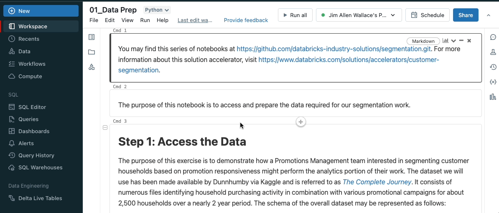
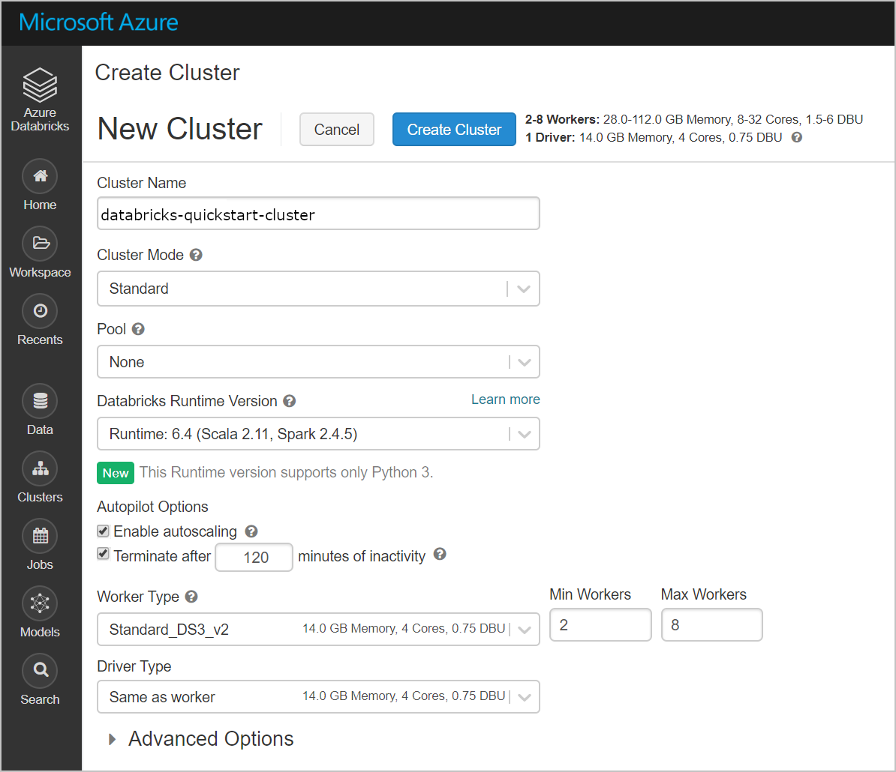

### Introdução ao Databricks

#### O que é Databricks?

O Databricks é uma plataforma de análise de dados e inteligência artificial baseada na nuvem, projetada para permitir a engenharia de dados, a ciência de dados e o machine learning em escala. Foi criado pelos fundadores do Apache Spark, uma estrutura de computação distribuída de código aberto amplamente utilizada em big data. O Databricks oferece uma solução unificada que simplifica a análise de dados, combinando o poder de processamento distribuído do Spark com um ambiente de desenvolvimento colaborativo.

#### Arquitetura

#### Principais funcionalidades do Databricks

##### Apache Spark

No núcleo do Databricks está o Apache Spark, que permite o processamento rápido e eficiente de grandes volumes de dados. O Spark suporta uma ampla gama de operações de processamento de dados, incluindo ETL (extração, transformação e carregamento), análise em tempo real, processamento de streaming e machine learning. O Databricks abstrai a complexidade do Spark, permitindo que os usuários se concentrem em suas análises sem precisar se preocupar com a infraestrutura subjacente.

##### Suporte a múltiplas linguagens

O Databricks suporta várias linguagens de programação, como Python, Scala, SQL, R e Java. Essa flexibilidade permite que diferentes perfis de profissionais, desde engenheiros de dados até cientistas de dados e analistas de negócios, trabalhem juntos na mesma plataforma, utilizando as linguagens com as quais estão mais familiarizados. Além disso, os usuários podem misturar e combinar linguagens dentro do mesmo notebook, o que é particularmente útil em projetos colaborativos.

##### Notebooks colaborativos

Uma das funcionalidades mais destacadas do Databricks são os notebooks colaborativos. Esses notebooks combinam código, visualizações e documentação em um único documento, facilitando a exploração de dados, a experimentação e a prototipagem. A capacidade colaborativa permite que várias pessoas trabalhem simultaneamente no mesmo notebook, facilitando a troca de ideias e a construção coletiva de soluções.

##### Clusters gerenciados

O Databricks simplifica o processo de criação e gerenciamento de clusters de computação. Um cluster é um conjunto de máquinas virtuais que executam tarefas de processamento distribuído. O Databricks cuida do provisionamento, escalonamento e manutenção desses clusters, permitindo que os usuários se concentrem no desenvolvimento de soluções e análises de dados, sem se preocupar com a administração da infraestrutura.

##### Integração com serviços de nuvem

O Databricks está disponível nas principais plataformas de nuvem, como Amazon Web Services (AWS), Microsoft Azure e Google Cloud Platform (GCP). Essa integração permite que os usuários acessem e processem dados armazenados na nuvem, utilizando os serviços de armazenamento e bancos de dados nativos dessas plataformas. Além disso, o Databricks pode aproveitar os recursos de escalabilidade e segurança oferecidos por esses provedores de nuvem.

##### Pipeline de dados unificado

O Databricks oferece uma plataforma unificada para a construção de pipelines de dados, permitindo a ingestão, transformação, análise e modelagem de dados em um único ambiente. Isso facilita a automação de processos e a integração de diferentes etapas do fluxo de trabalho de dados, desde a coleta até a análise avançada e a implementação de modelos de machine learning.

##### Segurança e Governança

O Databricks fornece uma variedade de ferramentas para garantir a segurança e a governança dos dados. Isso inclui controle de acesso baseado em funções (RBAC), criptografia de dados em trânsito e em repouso, e auditorias detalhadas. Essas funcionalidades são essenciais para proteger dados sensíveis e cumprir com regulamentações de conformidade, garantindo que apenas usuários autorizados tenham acesso a informações críticas.

## Navegação
- [Anterior](00-passo-a-passo.md)
- [Próximo](02-arquitetura.md)
