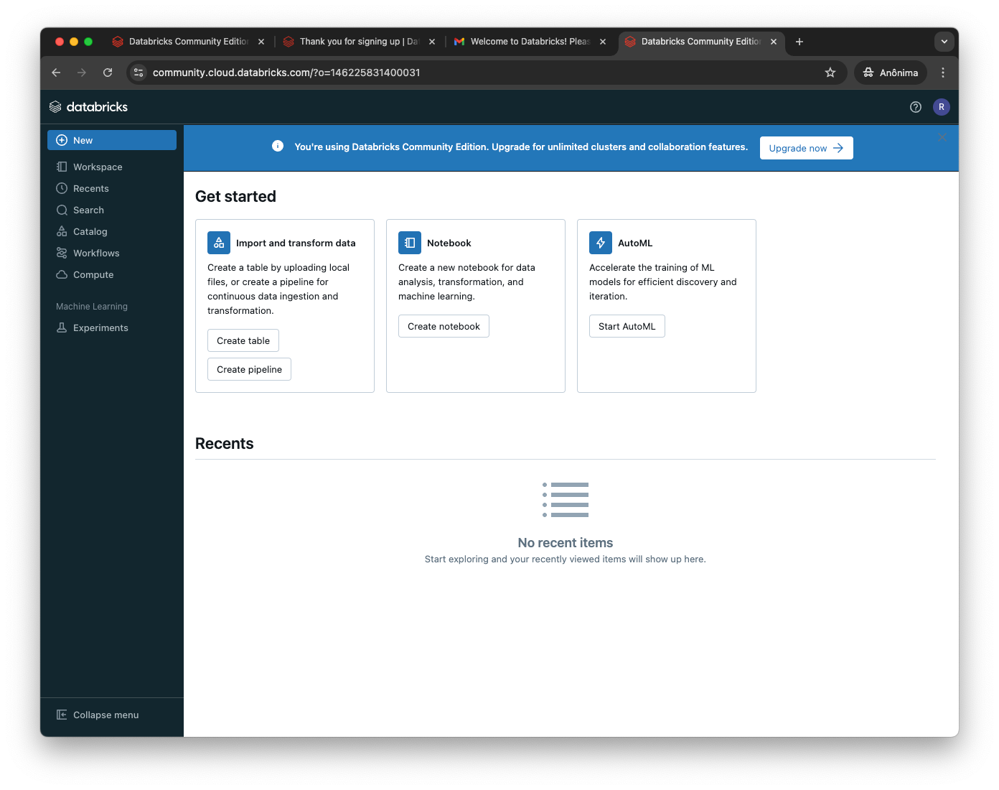
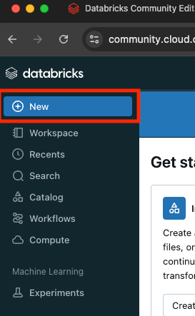
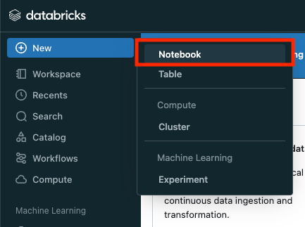
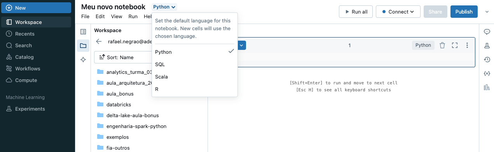
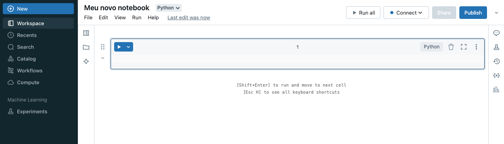
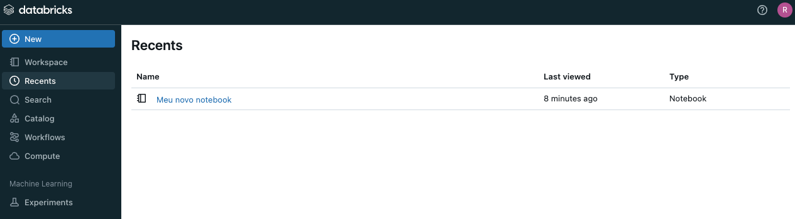
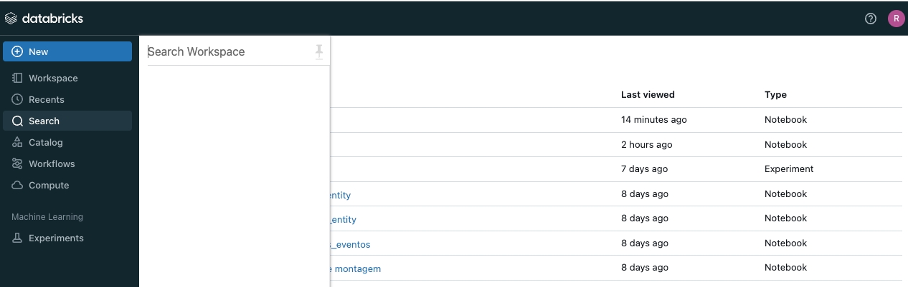
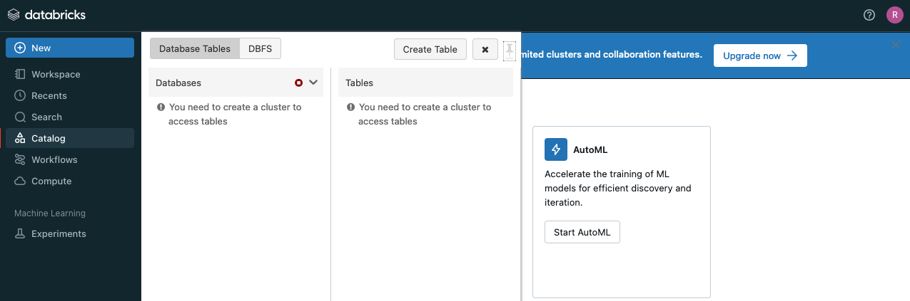
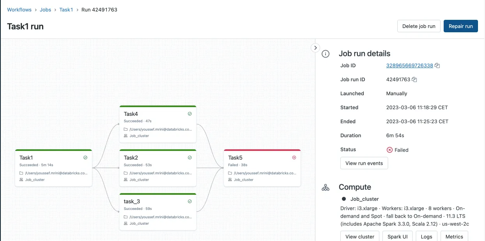
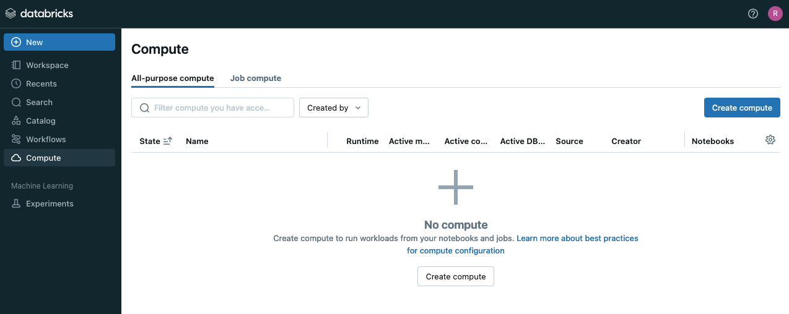

### Navegação inicial pela interface do Databricks

#### Dashboard Principal

- Após fazer login, você será levado ao Workspace, que é o ambiente principal de trabalho no Databricks. O Workspace organiza seus recursos, como notebooks, clusters, jobs e dados, em uma interface simples e intuitiva.
- No menu lateral, você encontrará as principais opções de navegação, incluindo "Home", "Workspace" (notebooks), "Recents", "Search", "Catalog", "Workflows", "Compute" e "Experiments".

#### Workspaces (Notebooks)
- Notebooks são o coração do Databricks, permitindo que você escreva, execute e visualize código em um ambiente interativo. Eles combinam a funcionalidade de um editor de código com a capacidade de exibir visualizações de dados e incluir documentação.

- Para criar um novo notebook, clique em "New" no menu lateral e selecione "Notebook". Você será solicitado a dar um nome ao notebook e escolher a linguagem de programação principal (Python, Scala, SQL, R).

- Dentro do notebook, você pode alternar entre células de código e texto, executar comandos e visualizar os resultados imediatamente, tudo dentro da mesma interface.

#### Recents

- Dentro do **menu Recents** você pode vizualizar os ultimos arquivos que foram acessados.

  
#### Search

O **menu Search** no Databricks permite que você pesquise de maneira eficiente por diferentes tipos de recursos dentro do seu ambiente Databricks. Aqui estão as principais funcionalidades:

- Pesquisa de Notebooks: Localize rapidamente notebooks específicos por nome ou conteúdo.
- Pesquisa de Jobs e Workflows: Encontre jobs agendados ou em execução e workflows, facilitando a administração e monitoramento.
- Pesquisa de Dados: Acesse tabelas, views e outros ativos de dados dentro do catálogo de dados.

#### Catalog

- O **menu Catalog** no Databricks refere-se ao **Unity Catalog**, uma ferramenta de governança de dados que permite gerenciar, auditar e proteger dados em um ambiente multi-nuvem. Com o Unity Catalog, você pode organizar dados em catálogos, esquemas e tabelas, aplicando controles de acesso detalhados e centralizados. Além disso, ele facilita o compartilhamento seguro de dados entre diferentes equipes e plataformas, garantindo conformidade com regulamentações e políticas corporativas. O Unity Catalog também oferece trilhas de auditoria para monitorar o uso dos dados.

#### Workflows

> Apenas na versão paga do Databricks

- Workflows no Databricks permitem a criação de fluxos de trabalho complexos que envolvem múltiplas etapas e dependências. Por exemplo, você pode configurar um workflow que ingere dados, os processa, treina um modelo de machine learning e gera relatórios, tudo de forma automatizada.

- A interface do Workflow permite visualizar e gerenciar o fluxo de execução, garantindo que todas as etapas sejam concluídas corretamente.

#### Compunte

O menu Compute no Databricks é onde você gerencia seus clusters, que são grupos de máquinas virtuais que processam suas tarefas de computação distribuída. Aqui, você pode:

- Criar e Configurar Clusters: Escolher o tipo de máquina, a versão do Databricks Runtime, e o número de nós (workers).

- Gerenciar Clusters: Escalar automaticamente, definir o tempo de inatividade para término automático e monitorar a utilização de recursos.

## Navegação
- [Anterior](02-arquitetura.md)
- [Próximo](04-exercicios.md)
